# Click Git

Right-click a folder. Run the Git command you meant.

Click Git is a small VS Code extension for people who live inside big workspaces: knowledge bases, project archives, experiments, client work, side projects, and many small repos sitting under one parent folder. Instead of opening a terminal, finding the right repo, and typing the right path, you can run common Git actions directly from the Explorer folder you are already looking at.

[Marketplace](https://marketplace.visualstudio.com/items?itemName=WunderForge.click-git) | [GitHub](https://github.com/wunderforge/click-git)

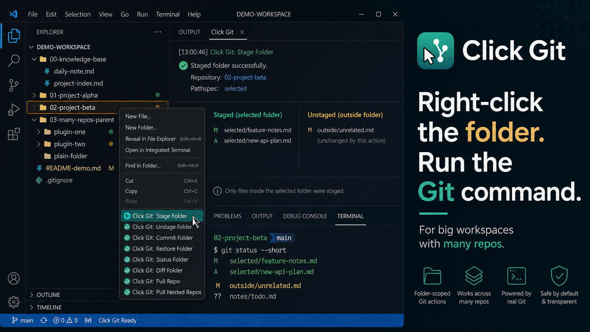

## Watch The Flow

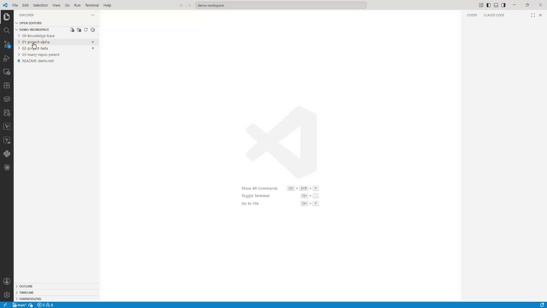

## Every Command, Scoped To The Folder You Clicked

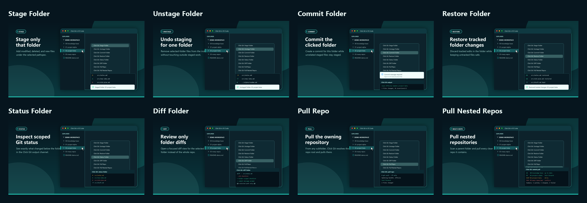

| Command | What It Does |
| --- | --- |
| 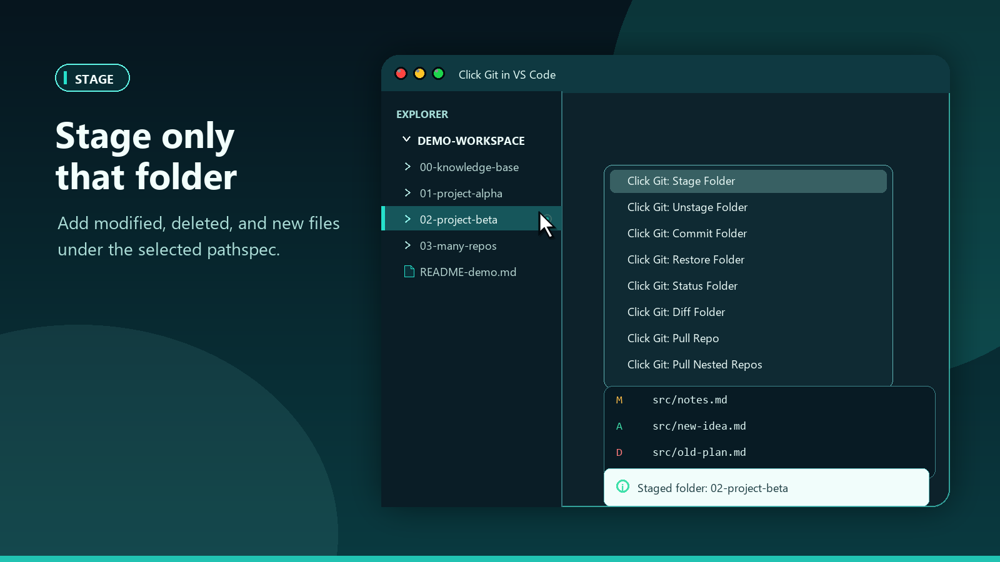 | Stage modified, deleted, and new files under the selected folder only. |
| 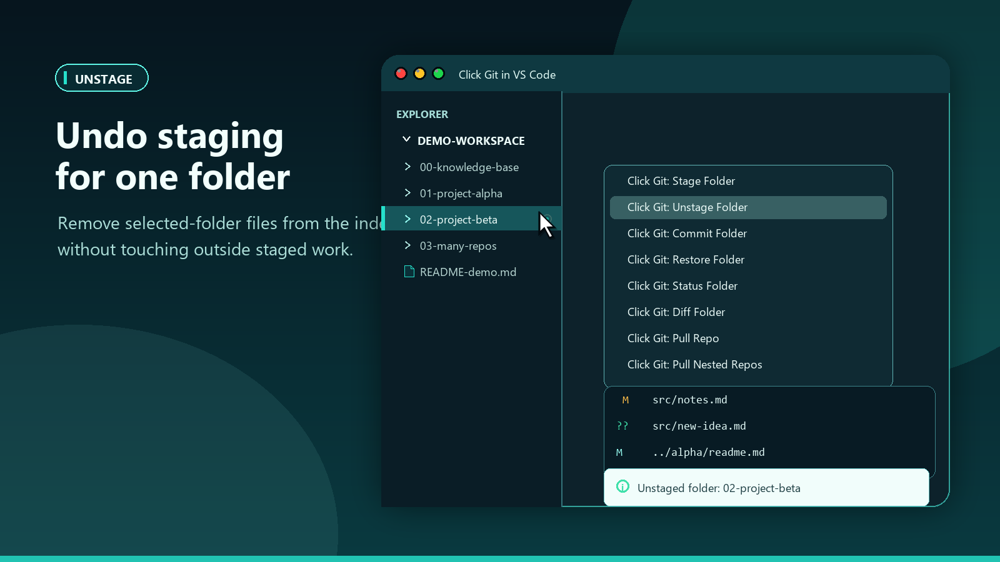 | Unstage the selected folder without touching unrelated staged work. |
| 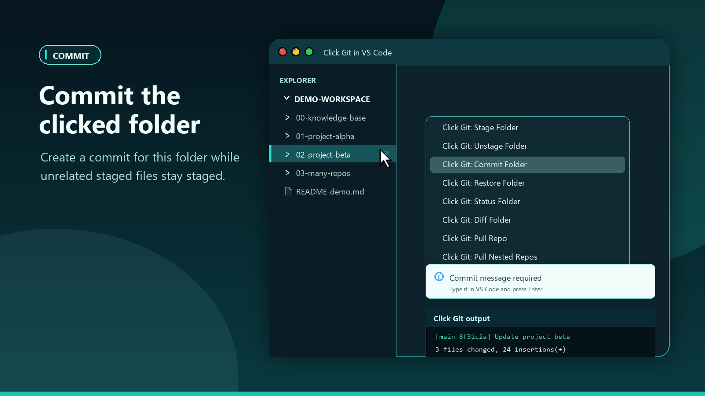 | Commit the clicked folder with a message prompt inside VS Code. |
| 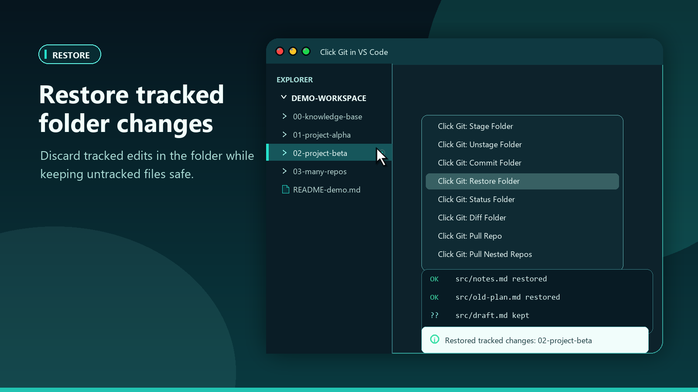 | Restore tracked changes in the folder while keeping untracked files. |
| 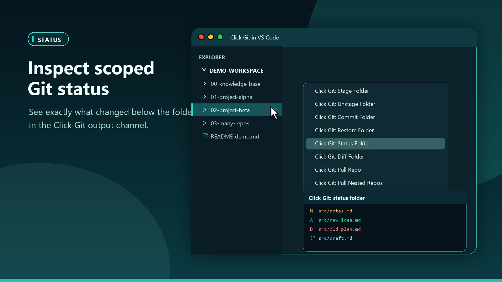 | Inspect folder-scoped status in the `Click Git` output channel. |
| 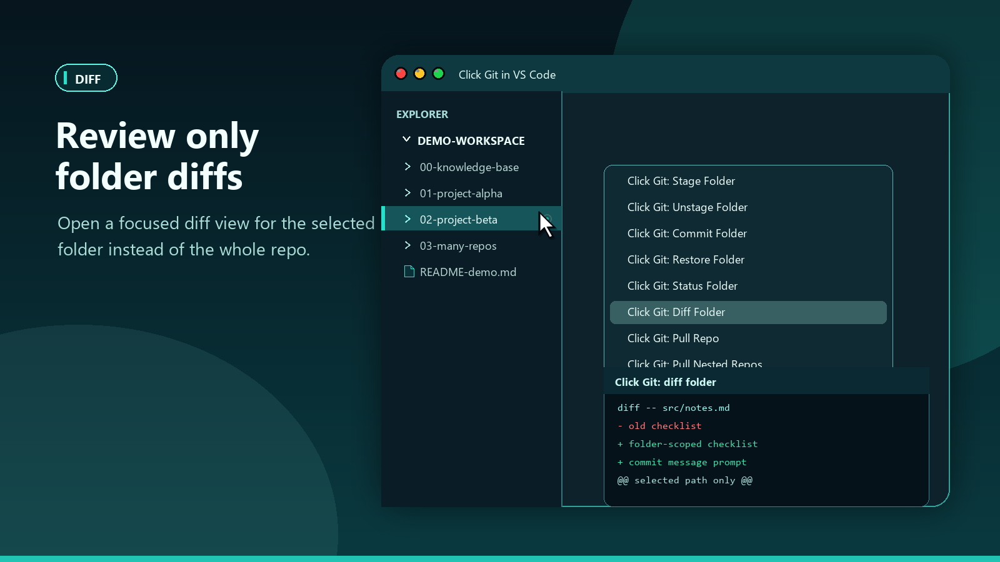 | Review diffs for the selected folder instead of the whole repo. |
| 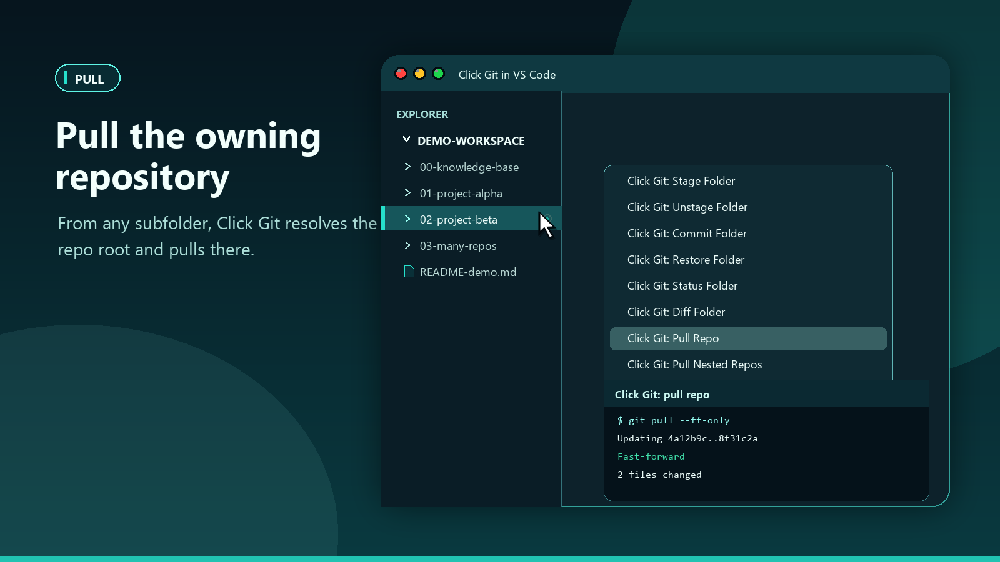 | Pull the owning repository from any folder inside it. |
| 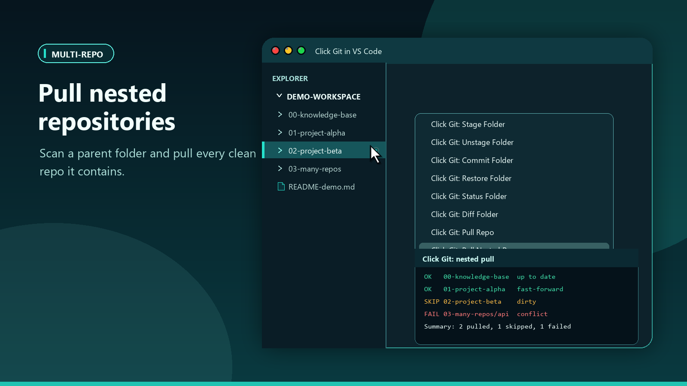 | Pull clean nested repositories under a parent folder and summarize the rest. |

## Real VS Code Proof

Right-click the folder you are already looking at, then run the Git action in place.

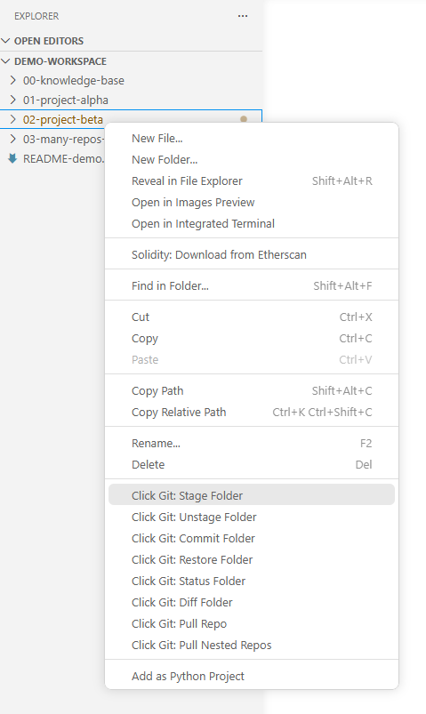

When a command runs, Click Git keeps the feedback close to your VS Code workflow.

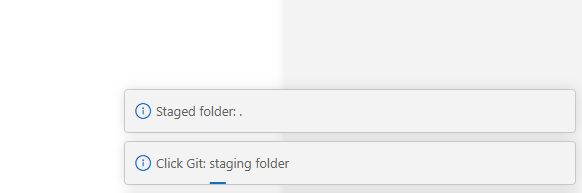

## Why It Exists

VS Code is great when you are focused on one repository. Real work is often messier.

You may have a large folder for your knowledge base, notes, prototypes, and active projects. Some folders are just documents. Some are standalone Git repos. Some are nested experiments. When you want to stage or inspect one project, the friction is tiny but constant: open terminal, `cd` into the right directory, run Git, jump back.

Click Git removes that little tax. Pick the folder in Explorer and act on it.

## Features

- Stage only the selected folder.
- Unstage only the selected folder.
- Commit the selected folder without accidentally including unrelated staged files.
- Restore tracked changes in the selected folder while keeping untracked files.
- Show folder-scoped status and diff in a dedicated `Click Git` output channel.
- Pull the owning repository from any folder inside it.
- Pull many nested repositories under a parent folder, with dirty repos skipped by default.

## Built For

- Personal knowledge bases that also contain project repos.
- Workspace folders that collect many independent repos.
- Developers who review generated or AI-assisted changes one folder at a time.
- People who prefer the Explorer tree for navigation but still want precise Git actions.
- Anyone tired of `cd ../../that-one-repo` for small Git chores.

## How It Works

1. Right-click a folder in VS Code Explorer.
2. Choose a `Click Git:*` command.
3. Click Git resolves the owning Git repository and runs the operation with an explicit pathspec.
4. Results and longer output go to the `Click Git` output channel.

Git pull is repository-scoped. If you run Pull Repo from a subfolder, Click Git resolves the owning repository and pulls at the repo root. It does not claim to protect against Git commands run from terminals, VS Code SCM, other extensions, or external Git clients.

## Safety Model

- Folder-scoped commands use explicit Git pathspecs.
- Pull commands are repository-scoped and default to `--ff-only`.
- Restore keeps untracked files by default.
- The extension requires a trusted workspace before it runs Git commands.
- The MVP does not install Git hooks, mutate `skip-worktree`, rewrite commits, or change repository configuration.

## Settings

- `clickGit.pull.ffOnly`: use `--ff-only` for pull commands. Default: `true`.
- `clickGit.pullNested.maxDepth`: maximum directory depth for nested repository discovery. Default: `4`.
- `clickGit.pullNested.includeDirtyRepos`: pull nested repositories with uncommitted changes. Default: `false`.
- `clickGit.commit.autoStageFolder`: stage the selected folder before committing it. Default: `true`.

## Development

```powershell
npm install
npm run compile
npm test
.\scripts\check.ps1
```

## Manual VS Code Smoke Test

1. Open this folder in VS Code.
2. Press `F5` and choose `Run Click Git Extension`.
3. In the Extension Development Host, open any folder that contains a Git repository.
4. Right-click a folder in Explorer and run one of the `Click Git:*` commands.
5. For status, diff, pull, and nested pull, inspect the `Click Git` output channel.

Fast disposable repo setup:

```powershell
$tmp = Join-Path $env:TEMP "click-git-manual"
Remove-Item -LiteralPath $tmp -Recurse -Force -ErrorAction SilentlyContinue
New-Item -ItemType Directory -Force -Path "$tmp\repo\selected","$tmp\repo\outside" | Out-Null
Set-Location "$tmp\repo"
git init -b main
git config user.name "Click Git Manual"
git config user.email "manual@click-git.test"
"base" | Set-Content selected\file.txt
"base" | Set-Content outside\file.txt
git add .
git commit -m initial
"changed" | Set-Content selected\file.txt
"outside" | Set-Content outside\file.txt
code "$tmp\repo"
```

Expected quick check:

- Right-click `selected` and run `Click Git: Stage Folder`.
- `git status --porcelain` should show `M  selected/file.txt` and ` M outside/file.txt`.

## Publishing

See [docs/PUBLISHING.md](docs/PUBLISHING.md).

## Contributing

See [CONTRIBUTING.md](CONTRIBUTING.md).

## License

MIT. See [LICENSE](LICENSE).
